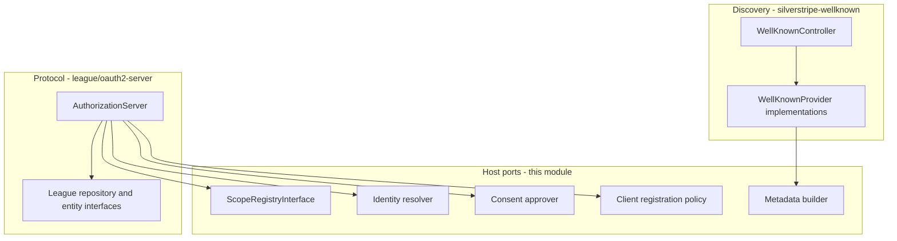

# OAuth2 authorization server roadmap

This document records the goal, what is already in place, and the ordered work to turn this sandbox into a generic Silverstripe 5 OAuth2 **authorization server**. Later plans go one step at a time. This file stays at outcome, done-when, and how we check it. It does not prescribe class lists, DataObject fields, or YAML keys beyond names needed to point at existing code.

Read [README.md](README.md) for how to run DDEV and tests.

## Assumptions

- The git repository stays `cms5x-auth`. The Composer package we extract is `archipro/silverstripe-oauth2-server`, namespace `Archipro\SilverstripeOAuth2\`, with application code under `app/src/` from the first step so extraction does not need a rename.
- The protocol engine is [`league/oauth2-server`](https://oauth2.thephpleague.com/) v9 (PSR-7). We implement its repository and entity interfaces. We do not write a second OAuth engine.
- Discovery and JWKS live in [`archipro/silverstripe-wellknown`](https://github.com/archiprocode/silverstripe-well-known). Changes that belong there are steps that **target** that repository.
- [`league/oauth2-client`](https://oauth2-client.thephpleague.com/) is the outbound client (Xero, Google, Outlook on ArchiPro). It is unrelated to this authorization-server work.

## Goal and roles

This module lets a Silverstripe 5 host act as an OAuth2 authorization server for first-party and partner apps. Clients can register themselves (dynamic client registration) instead of waiting for a human to mint every `client_id`.

Primary grant: **authorization code with PKCE**. Refresh and revocation sit beside it. Clients discover the issuer, JWKS, and endpoint URLs from well-known documents.

The host is the **authorization server**. The app that redirects the user and redeems the code is an **OAuth client**. The person who logs in is the **resource owner**. ArchiPro’s GraphQL JWT mutations stay a parallel, non-OAuth surface until that host chooses to migrate.

## Already in place

Status words used here and in the endpoint inventory: **in place**, **partial**, **to build**.

### `archipro/silverstripe-wellknown` — in place

Composer package [`archipro/silverstripe-wellknown`](https://github.com/archiprocode/silverstripe-well-known), source on GitHub as `silverstripe-well-known`.

- [`WellKnownController`](https://github.com/archiprocode/silverstripe-well-known/blob/master/src/Controllers/WellKnownController.php) serves `/.well-known/{filename}`.
- [`WellKnownProvider`](https://github.com/archiprocode/silverstripe-well-known/blob/master/src/Contracts/WellKnownProvider.php) is the provider contract.
- [`JsonWebKeySetProvider`](https://github.com/archiprocode/silverstripe-well-known/blob/master/src/Providers/JsonWebKeySetProvider.php) plus [`JsonWebKey`](https://github.com/archiprocode/silverstripe-well-known/blob/master/src/Contracts/JsonWebKey.php) publish JWKS.
- [`SecurityProvider`](https://github.com/archiprocode/silverstripe-well-known/blob/master/src/Providers/SecurityProvider.php) publishes `security.txt`.
- [`OpenIdConfigurationProvider`](https://github.com/archiprocode/silverstripe-well-known/blob/master/src/Providers/OpenIdConfigurationProvider.php) publishes a **minimal** OpenID configuration document.

### ArchiPro website — partial (reference consumer, not edited here)

[archipro-website](https://github.com/archiprocode/archipro-website) already uses well-known and a custom JWT stack:

- JWKS via `JwtWellKnownKey` and `ISignatureProvider`.
- Partial `openid-configuration` via `JwtOpenIdConfigurationProvider`.
- `JwtScopeRegistry` plus `JWTScopeAccessController` as a scope catalogue.
- `JWTAuthenticator` refresh-token families with rotation and theft detection (ORM types `JWTRenewalToken` / `JWTRenewalTokenFamily`; the credential is still a refresh token).
- GraphQL `JWTTokenCreate` and `JWTTokenRefresh` (whitelisted mutations, **not** OAuth2).

### This sandbox — in place (runtime only)

DDEV PHP 8.3 and MySQL 8.0, `ddev test`, and a stock Silverstripe installer. No OAuth2 module code yet.

## Architecture overview

Three layers. League and module ports get **default Injector bindings**. A host that only needs pre-created clients does not write PHP subclasses.

- **Discovery** serves JWKS and metadata JSON. It must not depend on League.
- **League** owns grants, PKCE, token encoding, and exception types. We implement storage interfaces only.
- **Module ports** are Injector seams the host rebinds (scopes, who is logged in, consent, who may register a client, how metadata is assembled).

## Endpoint inventory

Each path is owned by exactly one step. Later steps may *use* an earlier endpoint; they do not own it.

| Path | Status | Step | Notes |
| --- | --- | --- | --- |
| `/.well-known/jwks.json` | in place | 0 | silverstripe-wellknown; this module wires keys |
| `/.well-known/openid-configuration` | partial | 11 | stock provider is minimal; ArchiPro extends it |
| `/.well-known/oauth-authorization-server` | to build | 11 | [RFC 8414](https://www.rfc-editor.org/rfc/rfc8414) |
| `/oauth/authorize` | to build | 8 | this module |
| `/oauth/token` | to build | 7 | this module |
| `/oauth/register` | to build | 12 | [RFC 7591](https://www.rfc-editor.org/rfc/rfc7591) |
| `/oauth/revoke` | to build | 13 | [RFC 7009](https://www.rfc-editor.org/rfc/rfc7009) |
| `/oauth/introspect` | to build | 14 | optional later |
| `/oauth/userinfo` | to build | 14 | optional later |
| Device code endpoint | to build | 14 | optional later |
| Client credentials (token grant only) | to build | 14 | optional later |

## Steps

Each later detailed plan uses the same headings: **Outcome**, **Done when**, **Validated by**, **Targets**.

Discovery (step 11) and dynamic client registration (step 12) wait until the handshake in step 10 passes. Metadata that advertises broken endpoints, and a public register URL with no working token path, waste time and invite half-clients. Prove code → token → refresh first, then publish discovery and DCR.

### Step 0 — Package skeleton and requires

**Outcome:** The installer requires `archipro/silverstripe-wellknown`, `league/oauth2-server`, and `nyholm/psr7`. PSR-4 is `Archipro\SilverstripeOAuth2\` → `app/src/`. An empty `_config/oauth2.yml` exists. Well-known is wired with the stock providers so `/.well-known/jwks.json` answers (empty or placeholder keys until step 1).

**Done when:** `composer install` resolves those packages; the namespace autoloads; well-known routes exist without custom PHP.

**Validated by:** Composer install in DDEV; HTTP GET of the JWKS well-known document from the inventory.

**Targets:** this repository (`cms5x-auth`).

### Step 1 — Keys and config

**Outcome:** The host can supply an RSA private key, a 32-byte encryption key, token TTLs, issuer, and path prefixes through config/env. No grant logic yet.

**Done when:** Missing or short keys fail in a clear way at boot or first use; documented env/config names exist.

**Validated by:** Unit or kernel tests for config loading and key validation; a failed-boot or failed-request case when keys are absent.

**Targets:** this repository.

### Step 2 — League entities backed by DataObjects

**Outcome:** Persistence models exist for `OAuthClient`, `OAuthAuthCode`, `OAuthAccessToken`, and `OAuthRefreshToken`. Scope is a value object, not a table.

**Done when:** `dev/build` creates the tables; entities satisfy League entity interfaces at the type level.

**Validated by:** `ddev sake dev/build`; PHPUnit that writes and reads each DataObject.

**Targets:** this repository.

### Step 3 — Default repositories

**Outcome:** Default implementations of the five League storage interfaces League needs for auth code + refresh (client, auth code, access token, refresh token, scope). No `UserRepositoryInterface` (that interface serves the password grant, which we never enable).

**Done when:** Each repository is bound in Injector and covered by tests against the DataObjects from step 2.

**Validated by:** PHPUnit per repository (persist, revoke, lookup).

**Targets:** this repository.

### Step 4 — Generic scope registry

**Outcome:** Scopes are declared in YAML. A `ScopeRegistryInterface` is the host port. The League `ScopeRepository` adapts that registry.

**Done when:** Unknown scopes are rejected; known scopes round-trip through the adapter.

**Validated by:** PHPUnit with YAML fixtures; no ArchiPro `JwtScopeRegistry` in this repo.

**Targets:** this repository.

### Step 5 — AuthorizationServer factory

**Outcome:** An Injector factory builds League’s `AuthorizationServer` with the Authorization Code grant (PKCE required for public clients) and the Refresh grant enabled.

**Done when:** The server is resolvable from Injector; confidential vs public PKCE rules match League’s expected configuration.

**Validated by:** PHPUnit that the factory returns a server with those grants; public-client-without-PKCE is not enabled.

**Targets:** this repository.

### Step 6 — HTTP bridge and exception mapping

**Outcome:** Silverstripe `HTTPRequest` / `HTTPResponse` convert to and from PSR-7 (`nyholm/psr7`). League `OAuthServerException` maps to the correct HTTP status and OAuth JSON error body.

**Done when:** A controller can call League with a PSR-7 request and return a Silverstripe response; mapped errors are stable.

**Validated by:** PHPUnit on the bridge and on exception mapping (no live grants required).

**Targets:** this repository.

### Step 7 — `/oauth/token`

**Outcome:** The token endpoint redeems a valid authorization code (once PKCE and client auth succeed) and issues access and refresh tokens. Replay of a used code fails.

**Done when:** POST `/oauth/token` is routed; success and error JSON match OAuth2.

**Validated by:** Functional PHPUnit with a seeded client and code (authorize UI can still be stubbed).

**Targets:** this repository.

### Step 8 — `/oauth/authorize`

**Outcome:** The authorize endpoint runs the identity-resolver and consent ports. Defaults: Silverstripe Member login, auto-approve first-party clients. Redirects back with a code (or error).

**Done when:** GET/POST `/oauth/authorize` completes an auth-code request for a logged-in member against a first-party client.

**Validated by:** Functional PHPUnit (session member, query string, redirect location contains `code`).

**Targets:** this repository.

### Step 9 — Manual client provisioning

**Outcome:** Operators can create an `OAuthClient` without DCR: a BuildTask and/or fixture. A CMS admin ModelAdmin is optional in this step.

**Done when:** A documented command or fixture yields a client that steps 7–8 accept.

**Validated by:** PHPUnit or a documented `ddev sake` path that inserts a client and is then used by existing token tests.

**Targets:** this repository.

### Step 10 — End-to-end handshake quality gate

**Outcome:** One automated handshake is the quality gate for everything above: public client, S256 PKCE, authorize, token, refresh, reused code rejected.

**Done when:** That scenario is a single PHPUnit (or small suite) that fails if any hop regresses.

**Validated by:** `ddev test` on that suite; treat it as the gate before discovery and DCR.

**Targets:** this repository.

### Step 11 — Discovery (RFC 8414)

**Outcome:** Hosts publish accurate authorization-server metadata. Prefer a generic JSON document provider or a richer OpenID document, plus a new `oauth-authorization-server` provider. Add `RsaPublicJsonWebKey` so RSA public material is a first-class JWKS key. `addProvider()` lets a host **append** providers instead of replacing the whole list.

**Done when:** GET of the RFC 8414 document returns JSON that names this module’s authorize and token endpoints; the OpenID configuration document can be completed without wiping JWKS. Hosts can append a provider.

**Validated by:** HTTP GET of the two discovery documents this step owns; a test that `addProvider()` keeps existing providers.

**Targets:** [archiprocode/silverstripe-well-known](https://github.com/archiprocode/silverstripe-well-known) (this module only consumes the new APIs).

### Step 12 — Dynamic client registration (RFC 7591)

**Outcome:** POST `/oauth/register` creates a client. A registration-policy port decides who may register. Default policy: require an initial access token.

**Done when:** A valid registration request returns a client_id (and secret when confidential); the default policy rejects unauthenticated calls.

**Validated by:** Functional PHPUnit for success, missing token, and invalid metadata.

**Targets:** this repository.

### Step 13 — Revocation (RFC 7009)

**Outcome:** POST `/oauth/revoke` revokes an access or refresh token according to RFC 7009.

**Done when:** A presented token is unusable afterwards; unknown tokens still return 200 as the RFC requires.

**Validated by:** Functional PHPUnit: refresh after revoke fails; unknown token is not an error.

**Targets:** this repository.

### Step 14 — Optional grants and later endpoints

**Outcome:** Client credentials and device code are available **behind config**, off by default. Password and implicit grants are never enabled. `/oauth/introspect` and `/oauth/userinfo` stay later optional work, not v1.

**Done when:** Config flags exist; defaults keep only auth code + PKCE + refresh; tests prove password/implicit are absent.

**Validated by:** PHPUnit that factory flags include/exclude those grants; no route for password or implicit.

**Targets:** this repository.

## Package split

| Belongs in | Does | Must not |
| --- | --- | --- |
| `archipro/silverstripe-wellknown` | `/.well-known/*`, provider contract, JWKS, generic JSON/OIDC/AS metadata, `addProvider()` | Depend on League or OAuth DataObjects |
| `archipro/silverstripe-oauth2-server` (this codebase) | League wiring, OAuth DataObjects, `/oauth/*`, default ports | ArchiPro Member/JWT types |
| Host app (e.g. ArchiPro) | Rebind ports, keys, scopes, consent UI, production JWKS | Fork League |

## ArchiPro adoption (later, not in this repo)

This module’s defaults stay generic (DataObject-backed League repositories, YAML scopes, Member login). ArchiPro JWT types are **not** the module’s storage. When the website consumes the package, that **host** rebinds Injector ports — no fork of League:

- `ScopeRegistryInterface` → wrapper around `JwtScopeRegistry`.
- League `ScopeRepositoryInterface::finalizeScopes` → existing `canMemberAccessScope` (via `JWTScopeAccessController`).
- `RefreshTokenRepositoryInterface` → existing `JWTRenewalToken` families (rotation and theft detection stay).
- Access-token issuance → `JWTAuthenticator` claims and signing.
- Identity resolver → existing session and/or JWT.
- JWKS → existing `JwtWellKnownKey`.

GraphQL `JWTTokenCreate` / `JWTTokenRefresh` remain until clients migrate onto the OAuth token endpoint.

## Open decisions

- **Registration default:** keep token-gated DCR, or allow open registration in local/dev only.
- **OIDC ID tokens in v1:** recommend **no**. Ship OAuth2 access/refresh first; ID tokens are a later OpenID add-on.
- **Repository rename:** keep git name `cms5x-auth` until extraction, or rename when the Composer package name lands.
- **Consent UI owner:** default auto-approve for first-party clients in the module; the host owns any interactive consent page.
